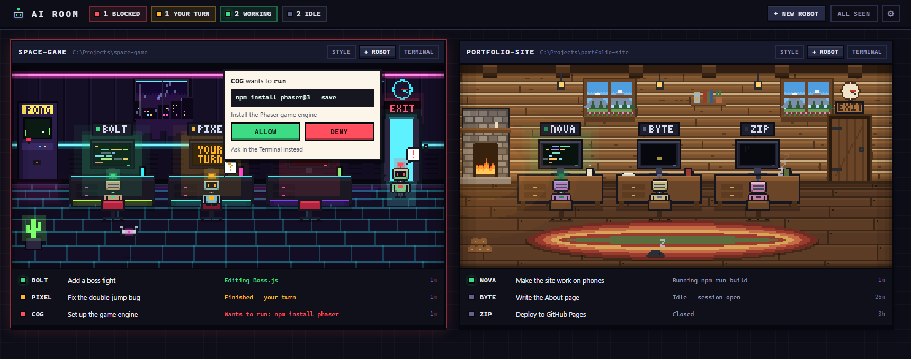
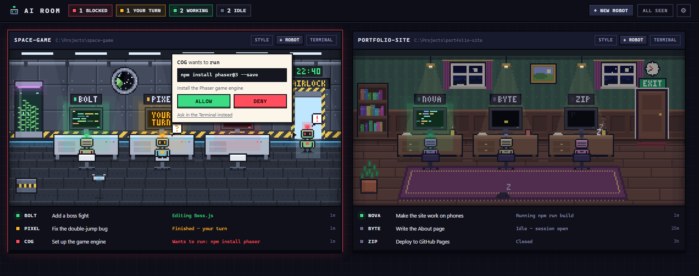

# AI Room for Windows

A pixel-art office for your [Claude Code](https://code.claude.com) sessions.
Every project folder is a room, every session is a robot at a desk. You can see
at a glance which one is waiting on you.



Everything runs on your own PC. The server only listens on `127.0.0.1`, and
nothing is sent anywhere.

## What you need

- Windows 10 or 11
- [Node.js](https://nodejs.org) 18 or newer
- [Claude Code](https://code.claude.com), in the Claude desktop app or the terminal

No `npm install` needed: it has no dependencies.

## Get it

Download it with **Code → Download ZIP** on GitHub and unzip it, or:

```bash
git clone https://github.com/astrostar123/ai-room-windows.git
```

Just want a look first? Start it, then open
[http://127.0.0.1:4777/?demo](http://127.0.0.1:4777/?demo) for a pretend office
full of robots.

## Start it

1. Double-click **`Start AI Room.bat`**. AI Room starts quietly in the
   background and the Room opens in its own window. Closing the window doesn't
   stop it, and double-clicking the .bat again just reopens the window.
2. Optional: double-click **`Create Desktop Shortcut.bat`** to get a robot icon
   on your desktop.
3. Once: click **Connect hooks** in the yellow banner. That unlocks instant
   updates, the Stop button, and answering permission questions from the Room.
   Sessions you already had open pick up the hooks after a restart.

To stop it: ⚙ → **Quit AI Room**. If something seems wrong, check
`%USERPROFILE%\.claude\ai-room\server.log`.

## What the colours mean

| Colour | State | What the robot does |
|---|---|---|
| 🟩 Green | Working | Types away while code scrolls on its screen |
| 🟨 Amber | Your turn: it finished and you haven't looked yet | Turns around, waves, shows "?" |
| 🟥 Red | Blocked: needs permission, or hit an error | Walks to the door holding the exact command, with **Allow / Deny** |
| ⬜ Grey | Idle | Screensaver if the session is open; asleep (Zzz) if it's closed |

Amber turns grey when you click the robot, or press **All seen**.

## Room styles



There are four styles: **Cozy office**, **Neon city**, **Space station** and
**Forest cabin**. By default every room gets its own. To change all of them, go
to ⚙ → **Room style**. To change just one room, use its **Style** button.

The windows follow the real time of day: sunny in the afternoon, stars and snow
at night. Every room has a pet, a cat or a little hover-drone, that wanders
around and takes naps.

## Things you can do

- **Click a robot** (or its row) to read the conversation.
- **Allow / Deny** at the door. "Ask in the app instead" sends the question back.
- **Stop**: the robot stops at its next step.
- **Reply** to any robot that isn't busy. The conversation continues in the
  background with `claude -p --resume`.
- **+ Robot** starts a new background session in that folder with a task you type.
- **Terminal** opens Windows Terminal running `claude` in that folder.
- The **chips at the top** (blocked / your turn / working / idle) jump to the
  next robot in that state.
- ⚙ **Settings**: sounds, Windows notifications, zoom, how long to show old sessions.

## Honest limits

- **Replying to a chat that's open in the Claude app or a terminal** runs the
  reply in the Room. That window can't be typed into from outside, so it won't
  show the new messages until you close and reopen the chat there. The Room
  asks you once before doing this. You can't reply while a robot is busy.
- **Reply and + Robot need the terminal `claude` signed in.** The Claude
  desktop app has its own login. Open a terminal, run `claude`, and type `/login`.
- **Permission questions only come to the Room while its window is on screen.**
  Otherwise the app asks as usual. If you don't answer in the Room within
  2 minutes (you can change this), the question goes back to the app.
- **Questions that need typed answers** (like Claude asking you to pick an
  option) always stay in the app. The robot still goes red so you notice.
- **Without hooks**, the Room still works by reading transcripts, but it
  updates a bit slower and can't stop other sessions or answer permissions.

## Where things live

| What | Where |
|---|---|
| This app | this folder |
| AI Room's settings, seen list, log, backups | `%USERPROFILE%\.claude\ai-room\` |
| Hooks (after Connect) | `%USERPROFILE%\.claude\settings.json`. A backup is saved before every change |

What it reads: `~/.claude/projects` (transcripts) and `~/.claude/sessions`
(the list of running Claude sessions). Every API call needs a secret token that
only the Room window knows, so other websites can't talk to it.

## Uninstall

1. ⚙ → **Disconnect hooks**. This removes only AI Room's hooks; your other
   settings stay.
2. Delete this folder and `%USERPROFILE%\.claude\ai-room`.

## How it's built (for tinkering)

No npm packages. Needs Node.js 18 or newer.

| File | Job |
|---|---|
| `server.js` | Local web server: state updates, buttons, hook events |
| `lib/transcripts.js` | Reads the end of each transcript to see what a session is doing |
| `lib/sessions.js` | Decides each robot's colour, name and room |
| `lib/permissions.js` | Keeps track of Allow/Deny questions |
| `lib/runner.js` | Starts `claude -p` for Reply / New robot, and opens terminals |
| `lib/hooks-setup.js` | Adds/removes the hooks in `settings.json` |
| `hook.js` | What Claude Code runs for each hook event |
| `mcp-approve.js` | Tiny MCP tool so background robots can ask for permission |
| `public/room.js` | Draws the desks, robots and screens, and moves robots and pets around |
| `public/themes.js` | The four room styles: walls, floors, windows, doors, decorations |
| `public/sprites.js` | Robot sprites and the 3×5 pixel font |
| `public/app.js` | The page: rooms, side panel, dialogs, sounds, demo mode |
| `tools/make-icon.js` | Draws `ai-room.ico` (the robot head icon) |
